## 🏁 Final Capstone Project – Respond and Recover from a Data Breach

My final Google Cloud Security capstone simulates an **incident response and recovery** at Cymbal Bank after a data breach.  
It covers vulnerability triage, remediation, firewall hardening, and compliance verification in **Google Cloud Security Command Center (SCC)**.

👉 [Read the full Capstone Report](../Capstone_Project/Final_Report_Cymbal_Bank_ProjectCapstone.docx)

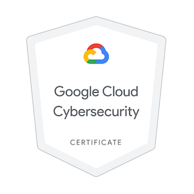

> **Capstone Project:** Respond and Recover from a Data Breach  
> **Organization:** Cymbal Bank  
> **Role:** Junior Cloud Security Analyst  
> **Focus:** Incident Response • Compliance • Network Hardening

## Overview
I acted as a Junior Cloud Security Analyst at **Cymbal Retail**, investigating a simulated Google Cloud data breach. I identified and remediated vulnerabilities across **Compute Engine**, **Cloud Storage**, and **VPC Firewall**, following **NIST CSF** and **PCI DSS 3.2.1** frameworks.  
This project focused on containment, eradication, recovery, and validation of a compromised cloud environment.

## Objectives
- Identify and prioritize vulnerabilities from SCC findings and PCI DSS report.  
- Contain, eradicate, and recover: rebuild VM from snapshot, secure storage, and limit firewall exposure.  
- Validate remediation through updated PCI DSS compliance results.

## Tools & Services Used
- **Google Cloud:** Security Command Center (SCC), Compute Engine, Cloud Storage, VPC Firewall  
- **Logging & Monitoring:** Cloud Logging, SCC Compliance reports  
- **IAM Concepts:** Service accounts, least privilege access  
- **Security Hardening:** Shielded VM, Secure Boot  
- **Identity-Aware Proxy (IAP):** SSH access via 35.235.240.0/20 range  

---

## Task Breakdown

### Task 1 – Analyze the Data Breach and Gather Information
I reviewed SCC **Risk Overview** and **Findings by Resource Type**, analyzing the PCI DSS 3.2.1 compliance report to identify non-compliant areas contributing to the breach. This helped prioritize remediation.

**Key non-compliant issues:**
- Open SSH (TCP/22) and RDP (TCP/3389) ports accessible from all IPs.  
- Firewall rule logging disabled.  
- VM with a public IP address and full API access via default service account.  
- Cloud Storage bucket publicly accessible.  

**By resource type:**
- **Compute Instance:** Public IP exposure, disabled Secure Boot.  
- **Storage Bucket:** Public ACLs and disabled bucket-level uniform access.  
- **Firewall:** Overly permissive inbound rules.  
  

**Evidence:**
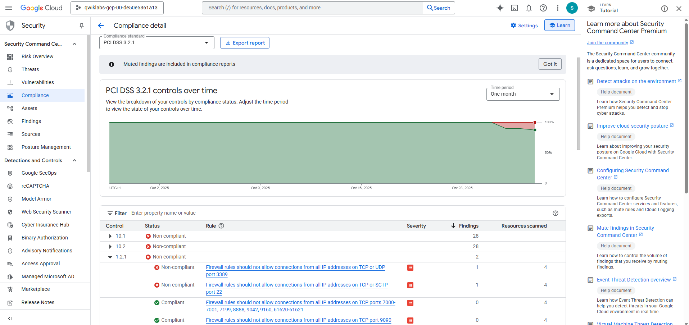
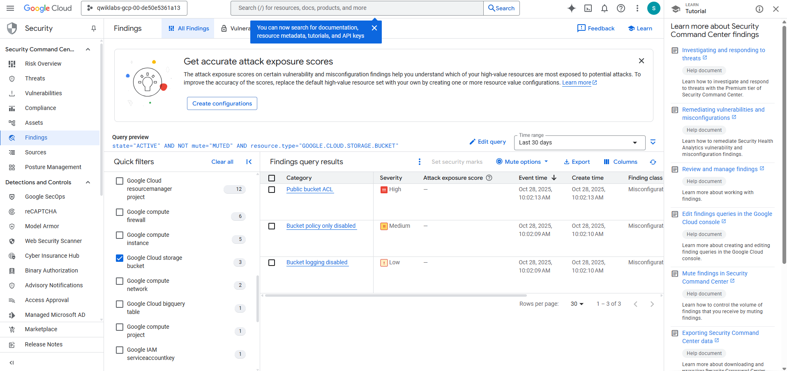
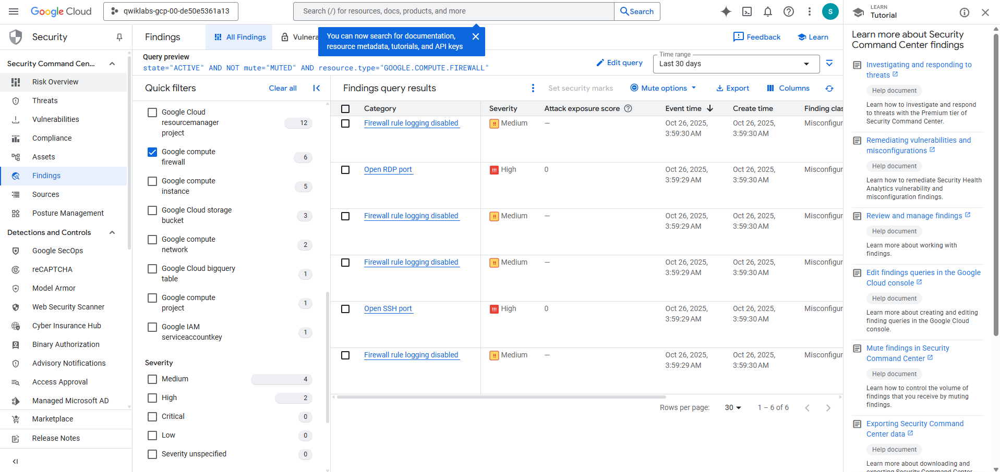
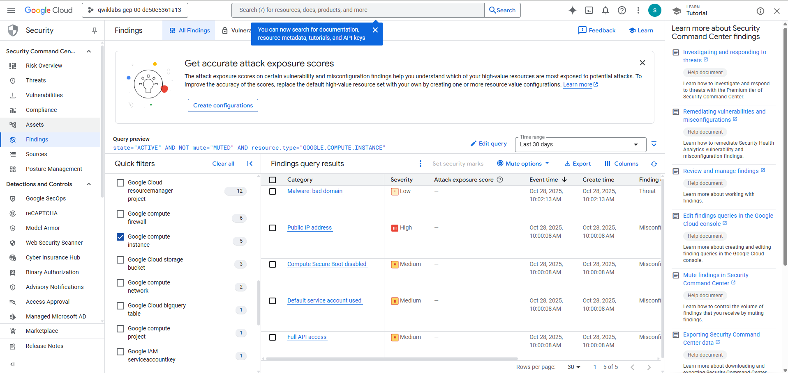

---

### Task 2 – Fix Compute Engine Vulnerabilities
I stopped the compromised VM (**cc-app-01**), created a new VM (**cc-app-02**) from a clean snapshot without a public IP, and enabled **Secure Boot**.  
Finally, I removed the infected VM to ensure all malware traces were eradicated.
  
**Evidence:**
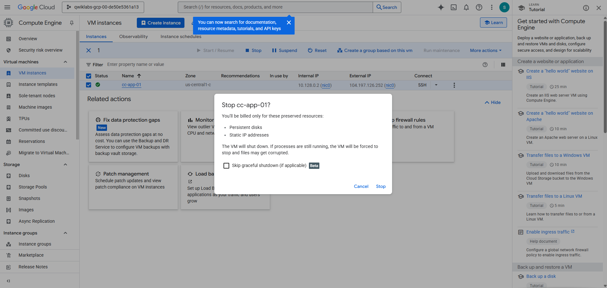
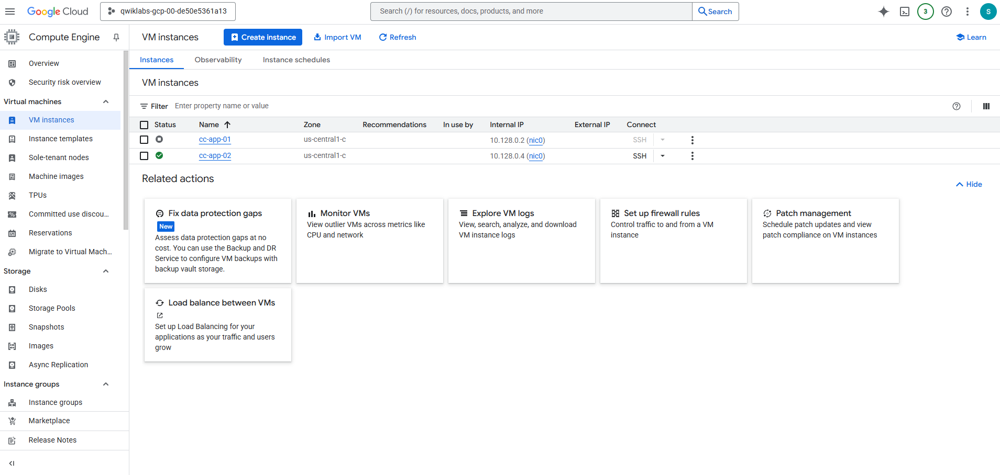
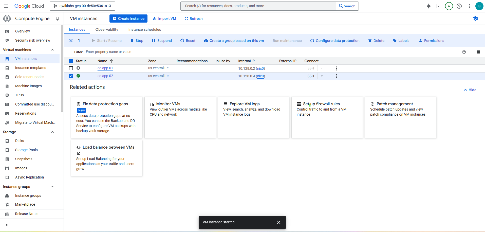

---

### Task 3 – Fix Cloud Storage Bucket Permissions
I revoked public access, switched to **Uniform bucket-level access**, and removed the `allUsers` principal.  
This closed external exposure paths and restored private access while maintaining operational permissions for service accounts.

**Evidence:**  
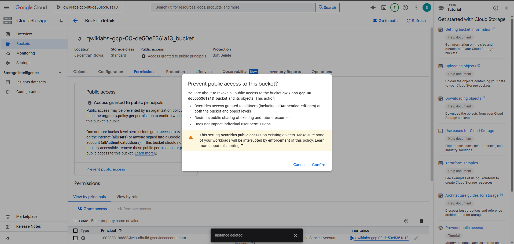

---

### Task 4 – Limit Firewall Ports Access
I created a **limit-ports** rule allowing **SSH (TCP/22)** only from the Google IAP range `35.235.240.0/20`.  
This ensures only authenticated administrators can connect via IAP, blocking all direct external SSH attempts.

**Evidence:**  
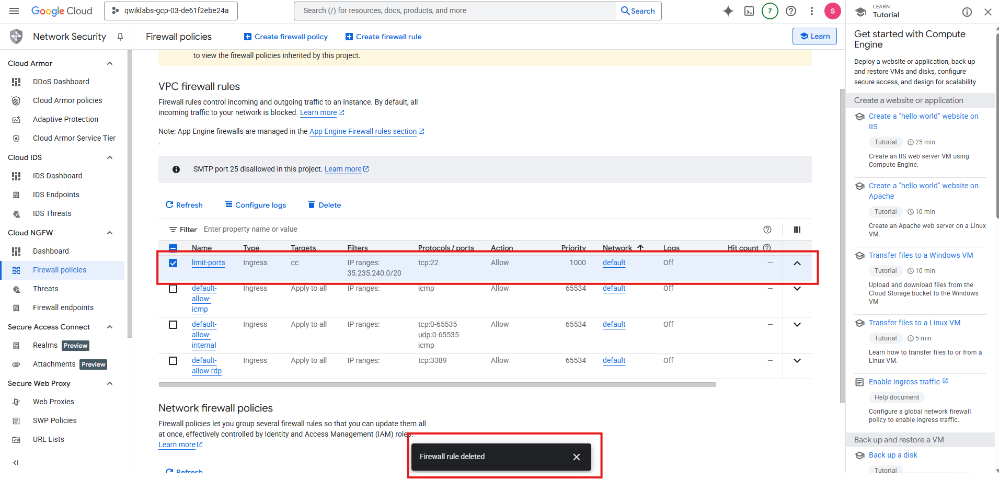

---

### Task 5 – Fix the Firewall Configuration
I deleted overly broad firewall rules:
- `default-allow-icmp`  
- `default-allow-rdp`  
- `default-allow-ssh`

Then enabled **logging** on `limit-ports` and `default-allow-internal` to track allowed traffic.  
These steps strengthened network segmentation and improved visibility through Cloud Logging.

**Evidence:**  
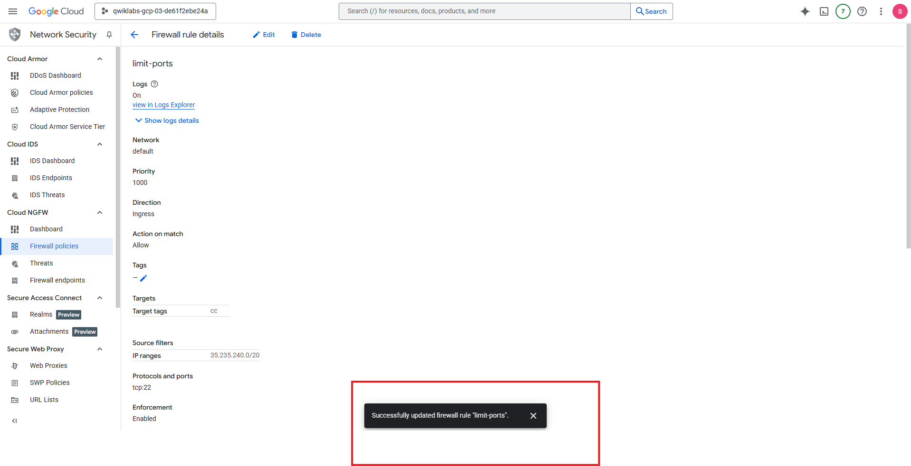

---

## Summary & Key Takeaways
- Removed all **public exposures** — no open SSH/RDP ports, no public buckets.  
- Improved **traceability and logging** for security monitoring.  
- Strengthened **IAM boundaries** and enforced least privilege.  
- Applied **NIST CSF functions:** Identify, Protect, Detect, Respond, Recover.  
- Achieved **PCI DSS compliance** validation for remediated assets.

---

## Conclusion
This project demonstrates the complete incident response lifecycle in a cloud environment.  

I successfully detected, contained, and remediated a simulated breach by:
- Rebuilding VMs securely.  
- Revoking public storage access.  
- Restricting firewall rules and enabling logging.  
- Validating the recovery through compliance checks.

Cymbal Bank’s cloud infrastructure was restored to a secure, auditable, and compliant state — resilient against future misconfigurations or external threats.

---

## References
- Google Cloud **Security Command Center (SCC)** – Findings, Assets, and Compliance  
- Google Cloud **VPC Firewall Rules & Logging**  
- Google Cloud **Storage IAM & Access Control**  
- **Shielded VM / Secure Boot** hardening  
- **NIST Cybersecurity Framework** and **PCI DSS 3.2.1** alignment  
