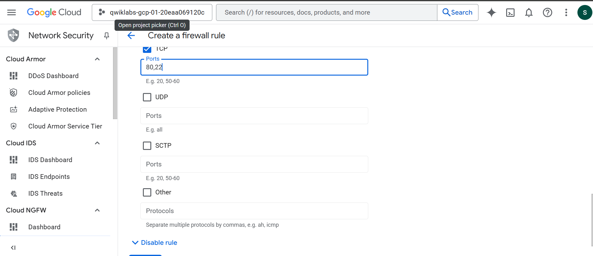
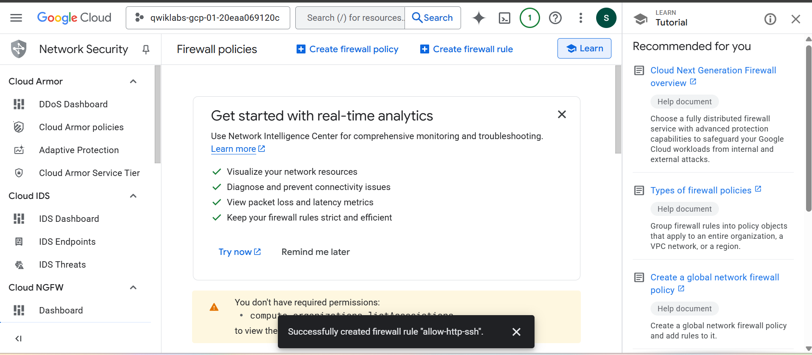
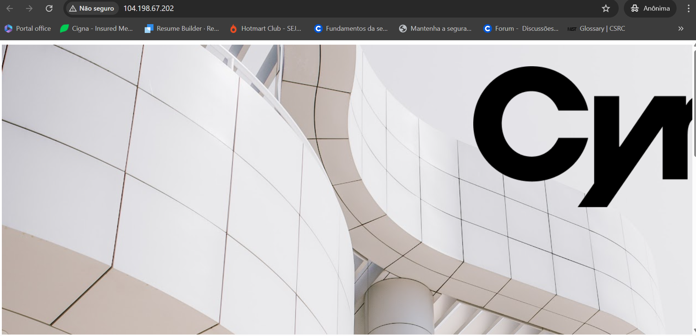
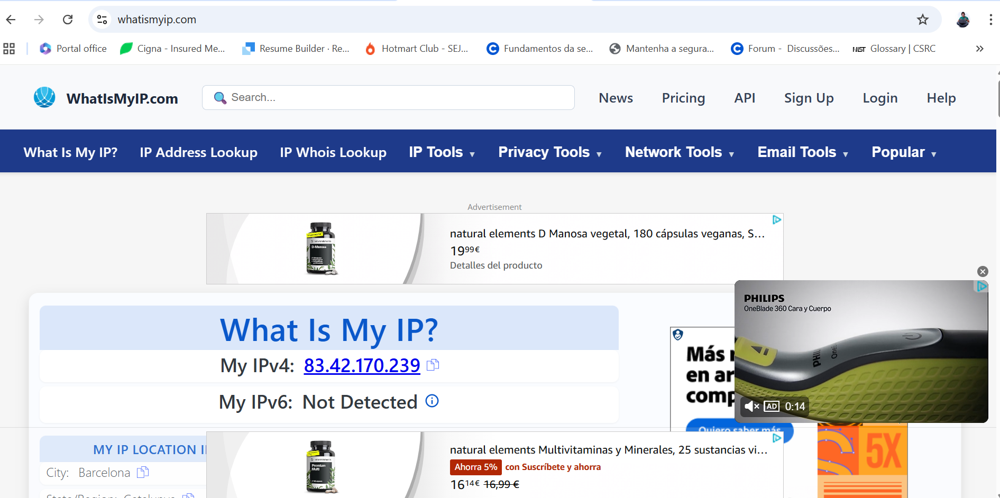
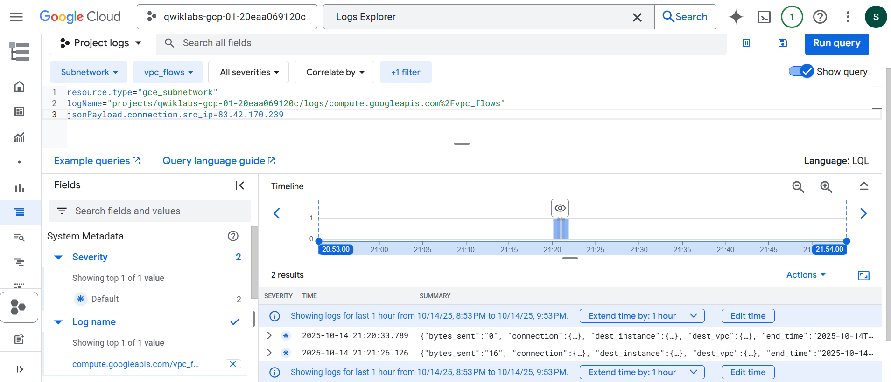
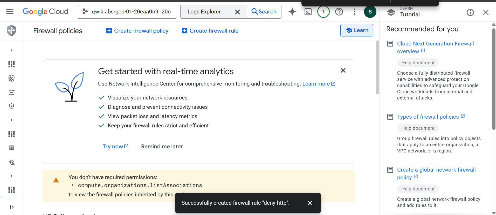
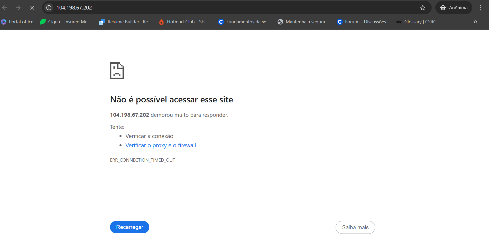
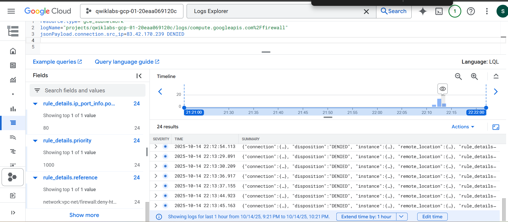

# 🔥 Lab 2 – Access a Firewall and Create a Rule

## 📚 Overview

In this lab, I learned how to protect a web server in Google Cloud by managing **firewall rules**, generating network traffic, and analyzing **VPC Flow Logs**.

---

## 🧪 Task-by-Task Summary with Evidence

---

### ✅ Task 1 – Create Firewall Rule

Created a rule to **allow traffic** on HTTP (port 80) and SSH (port 22), limited to VMs tagged `http-server`.

📸 Evidence:  
  

---

### ✅ Task 2 – Generate HTTP Network Traffic

Connected to the Apache web server using its **external IP** to simulate HTTP traffic.

📸 Evidence:  
  

---

### ✅ Task 3 – Analyze Flow Logs

Used **Logs Explorer** to search VPC Flow Logs by my IP, verifying HTTP traffic was allowed.

📸 Evidence:  

---

### ✅ Task 4 – Create Deny Rule for HTTP

Created a new firewall rule to **deny HTTP (port 80)** traffic from all sources to the tagged VM.

📸 Evidence:  

---

### ✅ Task 5 – Verify Denied Traffic in Logs

Tried reconnecting to the web server and confirmed access was denied. Checked logs to validate.

📸 Evidence:  
  

---

## 🧠 What I Learned

- How to configure and **apply custom firewall rules** in Google Cloud
- Using **target tags** to limit rule scope to specific VM instances
- **Monitoring traffic logs** via Logs Explorer
- The difference between **allowed** and **denied** dispositions
- Basics of **perimeter protection** and why firewall rules are important

---
