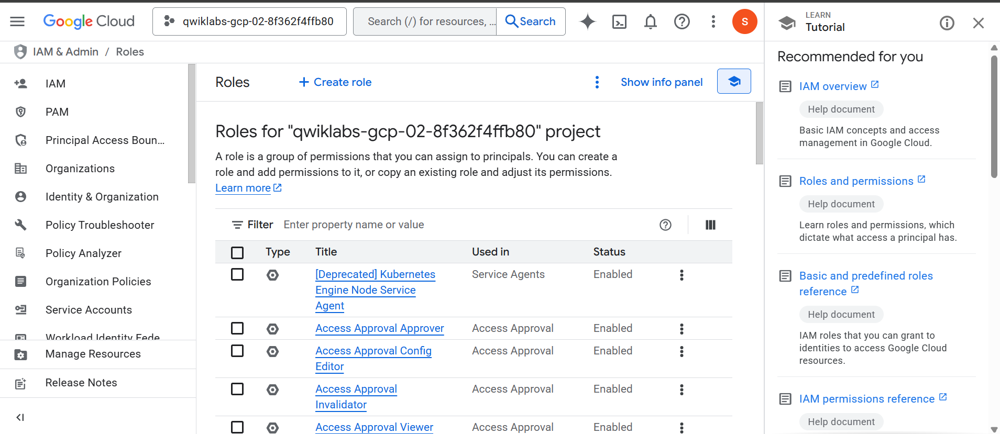
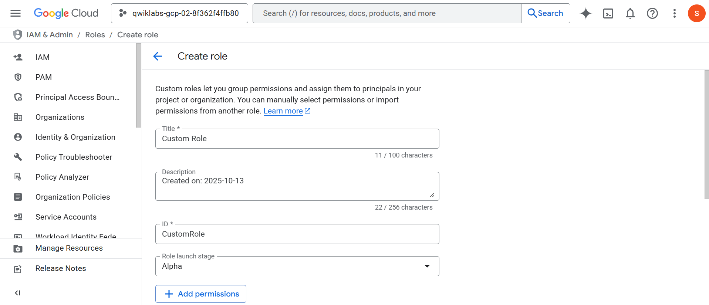
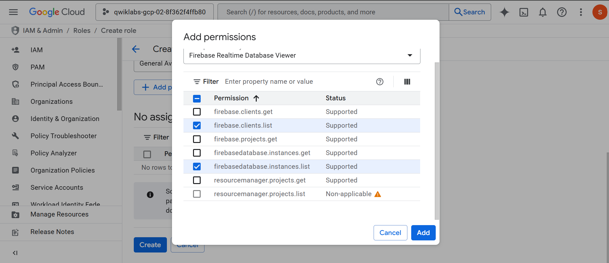
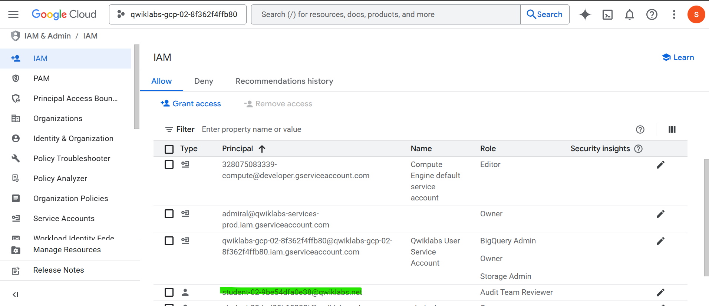
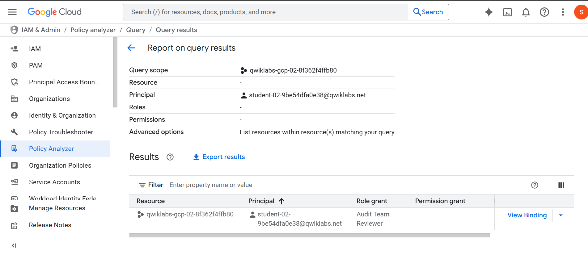

# 🧠 Lab Notes – Module 1: Create a Role in Google Cloud IAM

**Course:** 1302 – Identity and Access Management  
**Lab Name:** Create a Role in Google Cloud IAM  
**Date:** 2025-10-13  
**Analyst:** Gal  
**Scenario:** Cymbal Bank – Cloud security audit access  
**Lab Duration:** 1 hr 30 min

---

## 🔍 Lab Summary

Cymbal Bank required a custom IAM role to securely allow third-party auditors read-only access to its Firebase database. As a cloud security analyst, I was tasked with:

- Creating a custom IAM role with Firebase permissions
- Assigning that role to a specific user
- Verifying the assignment using Policy Analyzer

This lab reinforces **least privilege access** and **role-based access control (RBAC)** practices in cloud environments.

---

## ✅ Task 1: Create a Custom Role

### 🛠 Actions Performed:

1. Navigated to `IAM & Admin > Roles`
2. Clicked `+ Create Role`
3. Entered:
   - **Title:** `Audit Team Reviewer`
   - **ID:** `CustomRole`
   - **Description:** Read-only access to Firebase Realtime DB
   - **Launch Stage:** General Availability
4. Added permissions:
   - `Firebase Realtime Database Viewer`
   - `firebase.clients.list`
   - `firebasedatabase.instances.list`
5. Saved the role

### 📸 Evidence:

- IAM Roles Page Opened  
  

- Role Creation Form Filled  
  

- Custom Role Successfully Created  
  

---

## ✅ Task 2: Assign Role to User

### 🛠 Actions Performed:

1. Navigated to `IAM & Admin > IAM`
2. Clicked `Grant Access`
3. Entered **Username 2** (provided in lab environment)
4. Selected custom role: `Audit Team Reviewer`
5. Clicked `Save`

### 📸 Evidence:

- Role Assigned to Audit User  
  

---

## ✅ Task 3: Verify the Role Assignment

### 🛠 Actions Performed:

1. Opened `IAM & Admin > Policy Analyzer`
2. Created a **custom query**
3. Parameter: `Principal` = Username 2
4. Selected:
   - `List resources within resources matching your query`
5. Clicked `Run Query`

### 📸 Evidence:

- Role Displayed in Policy Analyzer Results  
  

---

## 🧠 Key Concepts Practiced

| Concept                     | Applied? |
|-----------------------------|----------|
| IAM Role Creation           | ✅ Yes    |
| Principle of Least Privilege| ✅ Yes    |
| Permission Granularity      | ✅ Yes    |
| RBAC in Google Cloud        | ✅ Yes    |
| Audit & Verification        | ✅ Yes    |

---

## 🏁 Final Notes

- The role created ensures **auditors only have access to view Firebase DBs**, nothing more.
- This lab exemplifies good **access control hygiene** and is a common task for cloud security analysts and GRC professionals.
- All steps validated successfully using **Check My Progress** within the lab.

---

## 📂 Files & Evidence

- `README.md`: Lab overview and screenshots
- `lab-notes.md`: Detailed technical task log (this file)
- `/Screenshots/`: Raw evidence for audit or portfolio

---

