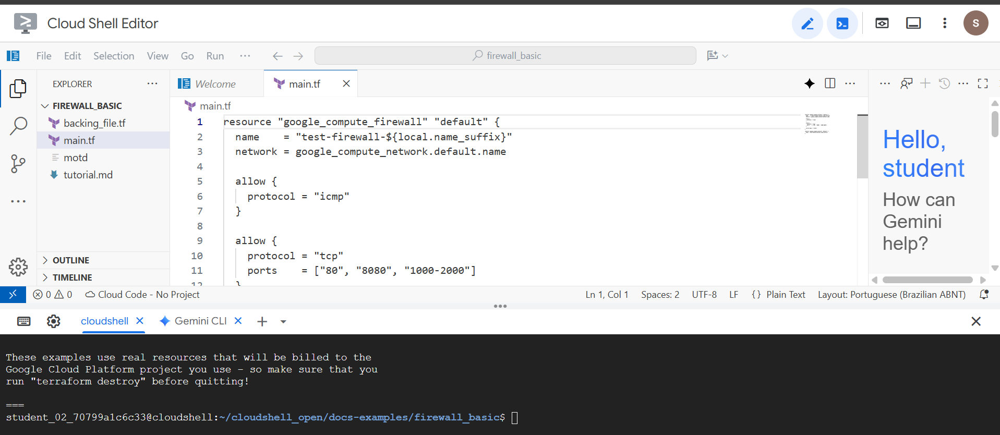
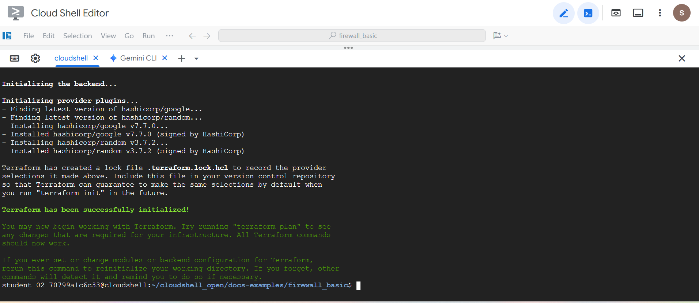

# 🧪 Lab 1 – Change Firewall Rules Using Terraform and Cloud Shell

## 📝 Overview

In this lab, I worked as a **Cloud Security Analyst** using **Terraform** — an Infrastructure as Code (IaC) tool — to automate the deployment and management of a **VPC network** and **firewall rules** in **Google Cloud Platform (GCP)**.

By the end of this lab, I had cloned a Terraform configuration, deployed a new network and firewall, and verified that the deployed resources matched the security configuration defined in the Terraform code. This approach demonstrates how IaC improves security, consistency, and repeatability in cloud environments.

---

## 🎯 Objectives

- Clone and inspect a Terraform configuration for network and firewall resources.
- Initialize and apply the Terraform configuration to deploy a new VPC and firewall rule.
- Verify in the GCP console that the deployment was successful and matched the code definition.

---

## 🧰 Tools & Services Used

- **Google Cloud Platform (GCP)**
- **Cloud Shell & Cloud Shell Editor**
- **Terraform** – Infrastructure as Code (IaC)

---

## 🔎 Task Breakdown

---

### 🧩 Task 1 – Clone the Terraform Repository

I started by launching **Cloud Shell** in the Google Cloud console and cloning a public Terraform example repository. This repository contained the configuration files (`main.tf`, `variables.tf`, etc.) needed to create a VPC network and firewall rules.

```bash
cloudshell_open --repo_url "https://github.com/terraform-google-modules/docs-examples.git" \
--print_file "./motd" --dir "firewall_basic" --page "editor" \
--tutorial "./tutorial.md" --open_in_editor "main.tf" --force_new_clone
```

I verified that the repository was cloned correctly and inspected the `main.tf` file to understand what resources would be deployed. The configuration defined:

- A **VPC network** named `test-network-${local.name_suffix}`
- A **firewall rule** named `test-firewall-${local.name_suffix}` allowing ICMP and TCP traffic on ports `80`, `8080`, and `1000-2000`

📸 **Evidence:**  


---

### 🔐 Task 2 – Initialize Terraform and Deploy Resources

Next, I set the project ID and initialized Terraform in the `firewall_basic` directory:

```bash
export GOOGLE_CLOUD_PROJECT=qwiklabs-gcp-00-a7cf477f8a69
terraform init
```

✅ **Screenshot Evidence:**  


Once initialization completed successfully, I applied the configuration to deploy the resources:

```bash
terraform apply
```

I typed `yes` to confirm when prompted. After a few moments, Terraform reported:

```
Apply complete! Resources: 3 added, 0 changed, 0 destroyed.
```

This confirmed that the new VPC and firewall rule were successfully deployed.

---

### 🧪 Task 3 – Verify the Deployment

Finally, I verified that the resources were created as expected in the Google Cloud console:

- **VPC Network:** `test-network-<suffix>`
- **Firewall Rule:** `test-firewall-<suffix>`

Under the firewall’s details, the **Action** and **Protocols/Ports** matched the configuration:

- **Action:** Allow  
- **Protocols & Ports:** `tcp:80`, `tcp:8080`, `tcp:1000-2000`, `icmp`

📸 **Evidence:**  


---

## ✅ Summary & Key Takeaways

- **Terraform** simplifies infrastructure management by allowing you to define resources as code, improving consistency and reducing human error.
- Using IaC ensures firewall rules and network policies are **repeatable, version-controlled, and auditable**.
- Verifying deployment after applying Terraform is essential — “Apply complete” doesn’t guarantee resources are configured securely.
- Automating security-related configurations, like firewall rules, is a key part of **proactive cloud security** and compliance best practices.

---

## 📚 Conclusion

Great work!

I've successfully built a VPC network and subnet using Terraform and the Cloud Shell. This lab provides the foundation to developing advanced automated solutions that can be given to system administrators to use with Terraform.

By creating the VPC network and firewall, I have gained a better understanding of how it enables you to automate the process of provisioning and modifying firewall rules. This helps establish consistency across various environments, while also helping reduce the chance of human error.

---


## 📚 References

- [Terraform Documentation](https://developer.hashicorp.com/terraform/docs)
- [Google Cloud – VPC Documentation](https://cloud.google.com/vpc/docs)
- [Google Cloud – Firewall Rules](https://cloud.google.com/vpc/docs/firewalls)
