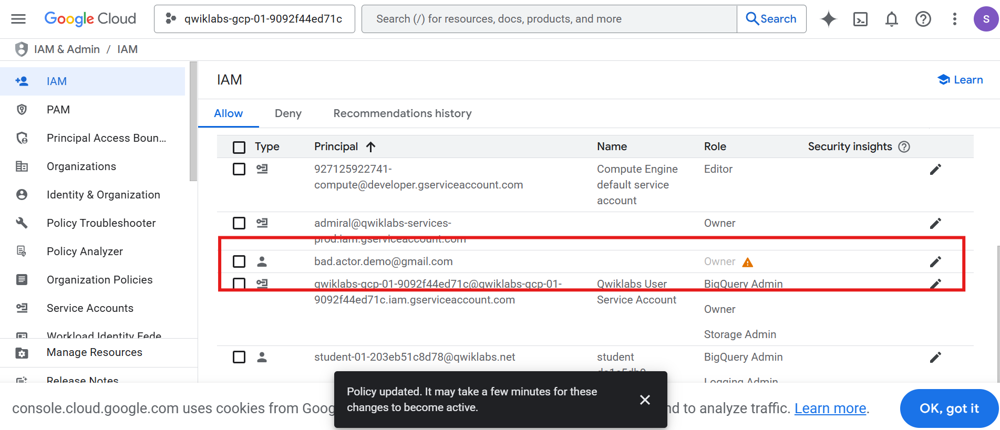
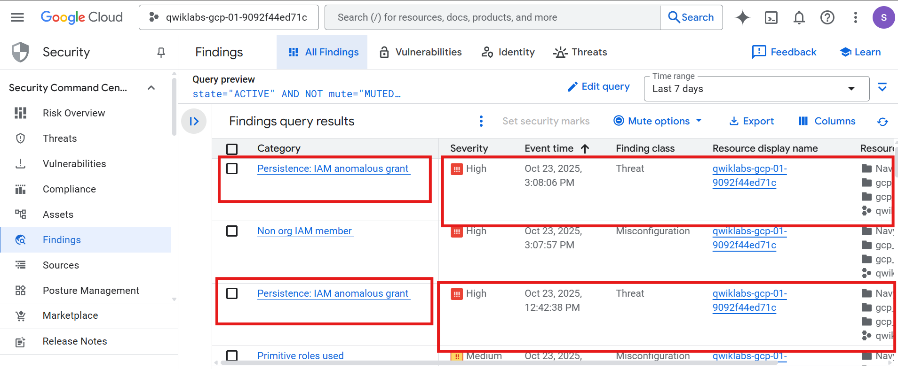
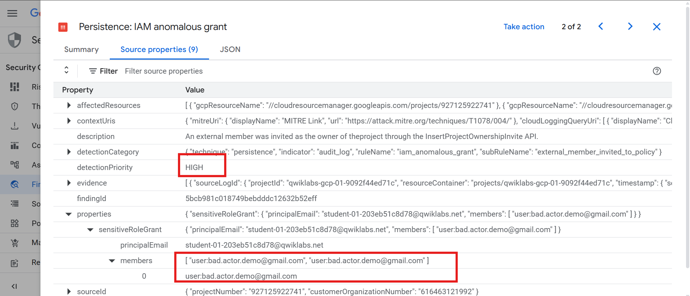
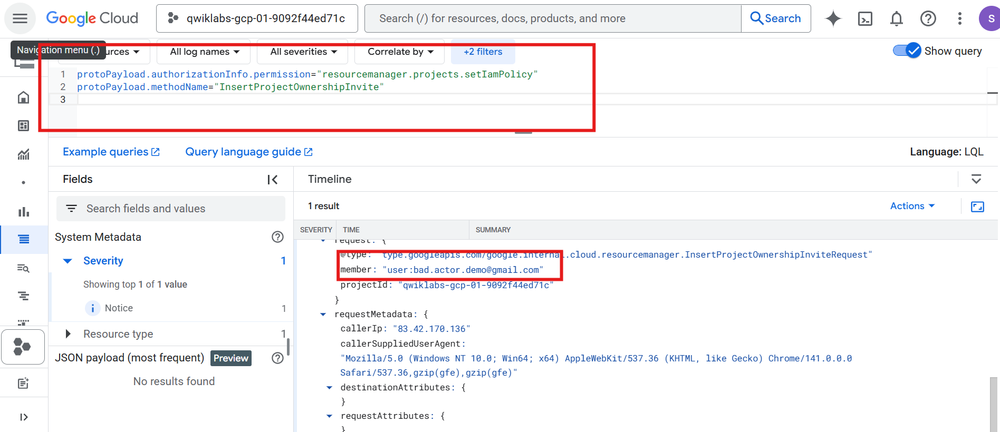
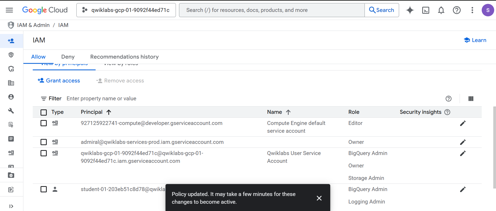

# Lab 1 – Determine the Difference Between Normal Activity and an Incident

---

## Overview

In this lab, I explored how **Event Threat Detection (ETD)** in **Security Command Center (SCC)** automatically identifies unusual IAM activities.  
By granting external access, I simulated a real-world suspicious event, analyzed SCC findings, validated evidence through **Cloud Logging**, and remediated the risk by removing the unauthorized permissions.  
This exercise reinforced the process of detection, investigation, and response within Google Cloud’s security operations framework.

---

## Objectives

- Understand how **ETD** detects anomalous IAM activity.  
- Investigate and classify findings as benign or malicious.  
- Validate alerts using **Cloud Logging** for forensic evidence.  
- Remediate the detected issue and confirm resolution.  

---

## Tools & Services Used

- **Google Cloud Console** (temporary lab environment)  
- **Security Command Center (Premium)**  
- **Event Threat Detection (ETD)**  
- **Cloud Logging (Logs Explorer)**  
- **IAM & Admin**

---

## Task Breakdown

### Task 1 – Grant Permissions to an External Account

I began by granting **Owner** permissions to an external Gmail account `bad.actor.demo@gmail.com`.  
This intentional misconfiguration was designed to trigger the ETD detector for anomalous IAM grants.  
After saving the changes, the external user appeared in the IAM list with full privileges, confirming that the suspicious event had been recorded.

**📸 Evidence:**  



---

### Task 2 – Access the Event Threat Detection Findings

After a few minutes, I opened **Security Command Center → Findings** and filtered by *Persistence: IAM Anomalous Grant*.  
Two findings appeared — one normal internal configuration and one external suspicious activity.  
This demonstrated ETD’s ability to distinguish between expected provisioning and potential threats.

**📸 Evidence:**  


---

### Task 3 – Analyze the Findings

I compared the two ETD findings in detail.  
The earliest finding was linked to internal `@qwiklabs.net` service accounts, which was normal.  
The second finding showed that my student account granted the **Owner** role to `bad.actor.demo@gmail.com`, confirming malicious behavior.  
This step emphasized the importance of context and user attribution when reviewing alerts.

**📸 Evidence:**  


---

### Task 4 – Validate Findings with Cloud Logging

Using **Cloud Logging → Logs Explorer**, I confirmed the SCC findings by running the following query:

```sql
protoPayload.authorizationInfo.permission="resourcemanager.projects.setIamPolicy"
protoPayload.methodName="InsertProjectOwnershipInvite"
The log entry showed my user as the principalEmail and the external Gmail as the member, matching the SCC alert.  
This validated the detection and provided forensic-level confirmation of the activity.
```

📸 Evidence:  


---

### Task 5 – Remediate the Finding

Finally, I remediated the issue by removing the Owner role from the external Gmail account.  
After saving, the user no longer appeared in the IAM list, and the SCC finding was marked as resolved.  
This completed the response phase and restored least-privilege access within the project.

📸 Evidence:  


---

## Summary & Key Takeaways

- Event Threat Detection continuously monitors logs to identify suspicious IAM activity.  
- SCC Findings provide a clear view of anomalies for rapid triage.  
- Cloud Logging acts as the source of truth for verification and evidence gathering.  
- Incident response requires both analysis and corrective action to close the loop.  
- Maintaining least privilege is essential for preventing privilege escalation risks.  

---

## Conclusion

This lab provided hands-on experience with Google Cloud’s threat detection and response workflow.  
By simulating and resolving a suspicious IAM event, I learned how alerts evolve from detection to investigation and finally to remediation.  
It reinforced key operational practices used daily by cloud security analysts — visibility, validation, and quick response.  

---

## References

- [Google Cloud Security Command Center Documentation](https://cloud.google.com/security-command-center/docs)  
- [Event Threat Detection Overview](https://cloud.google.com/security-command-center/docs/concepts-event-threat-detection-overview)  
- [Cloud Logging Documentation](https://cloud.google.com/logging/docs)  
- [Google Cloud IAM Documentation](https://cloud.google.com/iam/docs)
