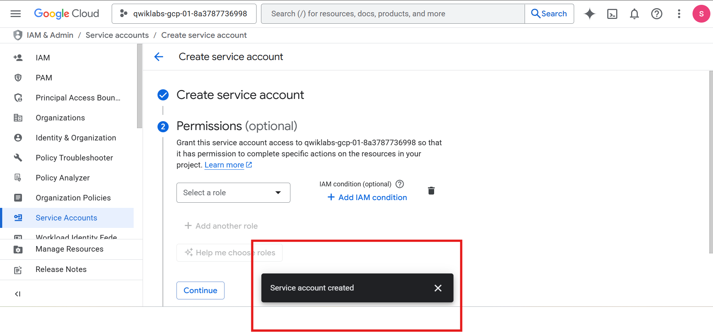
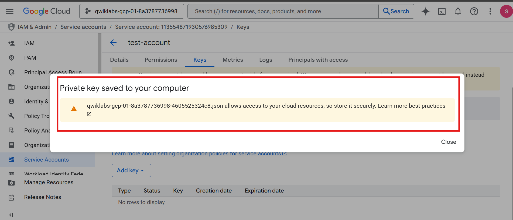
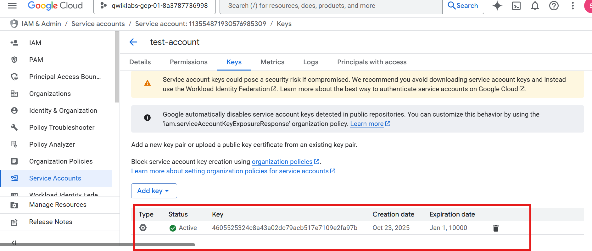
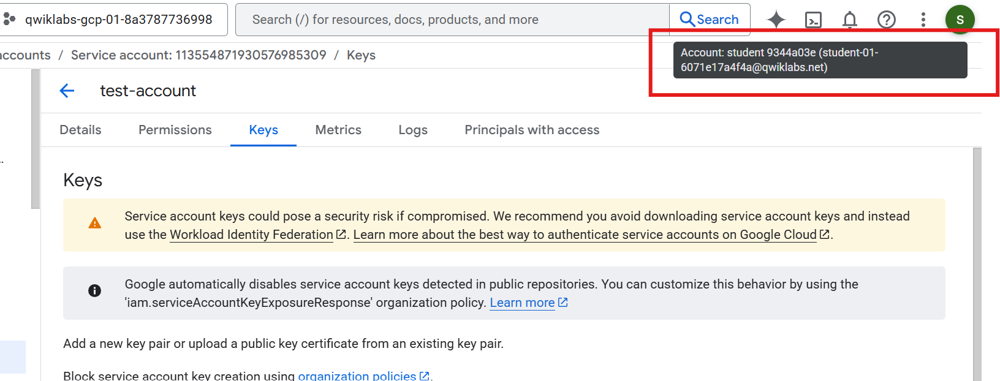
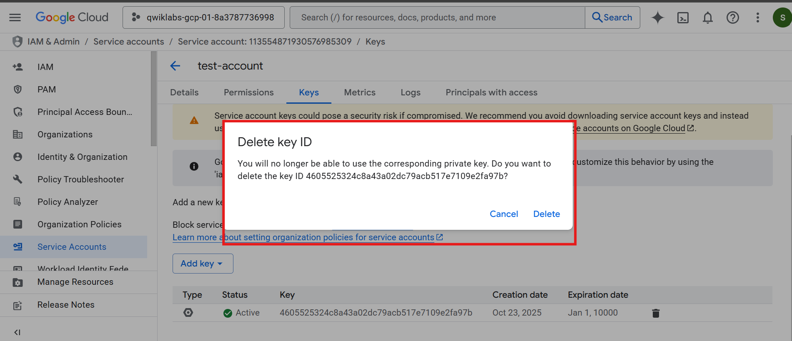

# 🧪 Lab 1 – Explore False Positives Through Incident Detection

---

## Overview

In this lab, I explored how **false positives** occur during incident detection in Google Cloud.  
Using **Security Command Center (SCC)**, I generated and analyzed a finding related to **user-managed service account keys**.  
By creating a service account, generating a key, triggering a detection, and finally remediating it, I learned to identify which alerts are legitimate threats and which are expected behaviors.

---

## Objectives

- Understand how a false positive appears in **Security Command Center (SCC)**.  
- Simulate a suspicious IAM action by creating and using a service account key.  
- Classify the alert correctly as a false positive.  
- Remediate the issue by deleting the key and restoring compliance.

---

## Tools & Services Used

- **Google Cloud Console**  
  - IAM & Admin → Service Accounts  
  - Security → Security Command Center (SCC)  
- **gcloud CLI** for authentication testing  
- Two Google Cloud **student accounts**  
  - *Account A*: Generates the false positive  
  - *Account B*: Investigates and remediates it

## Task Breakdown
---

### Task 1 – Create a Service Account

I created a new service account (`test-account`) using **IAM & Admin → Service Accounts**.  
This account is used to generate a benign IAM key that SCC will flag as suspicious.

**📸 Evidence:**  


---

### Task 2 – Generate and Download a JSON Key

I added a new **user-managed key** for the service account and downloaded the **JSON file**.  
This action simulates potentially risky behavior that can be detected by SCC.

### Task 2 – Generate and Download a JSON Key
**📸 Evidence:**  


---

### Task 3 – Trigger the Finding (Activate the Key)

Using Cloud Shell, I authenticated with the new service account key:

```bash
gcloud auth activate-service-account --key-file=<keyfilename>.json
```
This activation confirmed the key’s validity and triggered a **User-managed service account key** finding in **Security Command Center (SCC)**.

**📸 Evidence:**  


---

### Task 4 – Switch to the Analyst Account

I logged out from *Account A* and into *Account B* to simulate the separation between the user generating the event and the analyst investigating it.  
This separation prevents bias and mirrors standard **Security Operations Center (SOC)** procedures.

  
**📸 Evidence:**  
)

---

### Task 5 – Investigate the Finding in SCC

In **Security Command Center (SCC)**, I filtered findings for **IAM → User-managed service account key**.  
The detection appeared as expected. I examined timestamps, principal email, and key usage details to confirm that this was the lab-generated activity — a **false positive**.

**📸 Evidence:**  


---

### Task 6 – Remediate by Deleting the Key

To close the incident, I deleted the **user-managed key** from the service account.  
This action removed unnecessary access credentials, cleared the finding in SCC, and restored the environment to a secure state.

**📸 Evidence:**  
**📸 Evidence:**  


---

## Summary & Key Takeaways

- **False positives** are inevitable in any detection system; context and investigation define their meaning.  
- **SCC** effectively detects high-risk IAM actions, like service account key creation.  
- **Analysts must validate intent** — not every flagged action is malicious.  
- Enforcing **least privilege** and avoiding user-managed keys reduces alert noise.  
- Separating activity creation and analysis mirrors real-world SOC investigation practices.

---

## Conclusion

This lab demonstrated how to identify and remediate **false positives** in **Google Cloud Security Command Center**.  
By creating, analyzing, and resolving a user-managed service account key finding, I learned to differentiate between legitimate administrative actions and potential threats.  
The exercise reinforced practical SOC skills — **accurate classification, contextual analysis, and effective remediation**.

---

## References

- [Guide to False Positive Analysis](https://cloud.google.com/security-command-center/docs)  
- [Lockheed Martin’s Cyber Kill Chain in Practice](https://www.lockheedmartin.com/en-us/capabilities/cyber/cyber-kill-chain.html)  
- [Google Cloud IAM Documentation](https://cloud.google.com/iam/docs)  
- [Event Threat Detection Overview](https://cloud.google.com/event-threat-detection/docs)