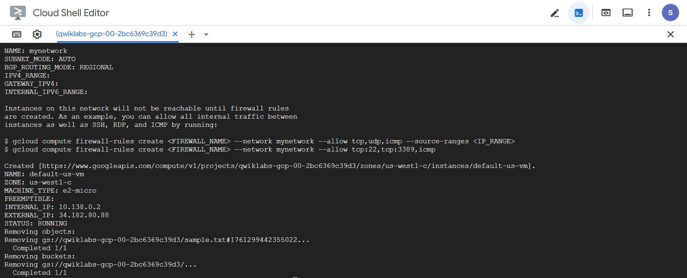
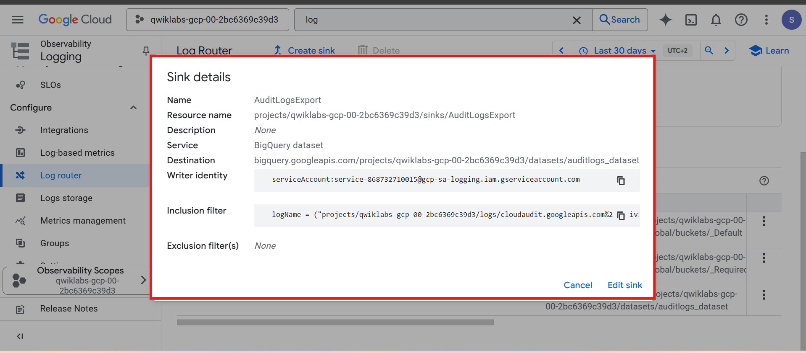
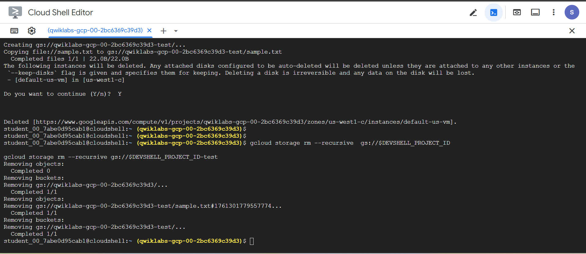
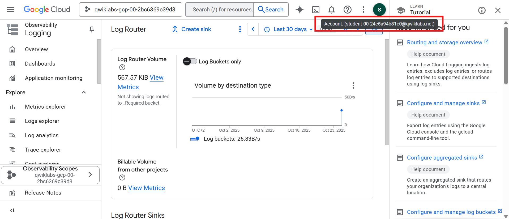
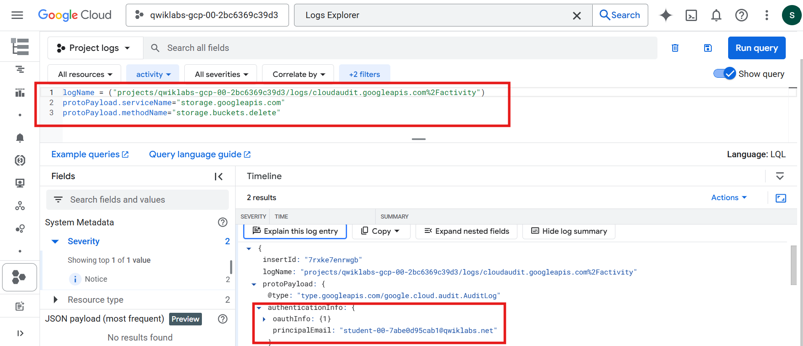
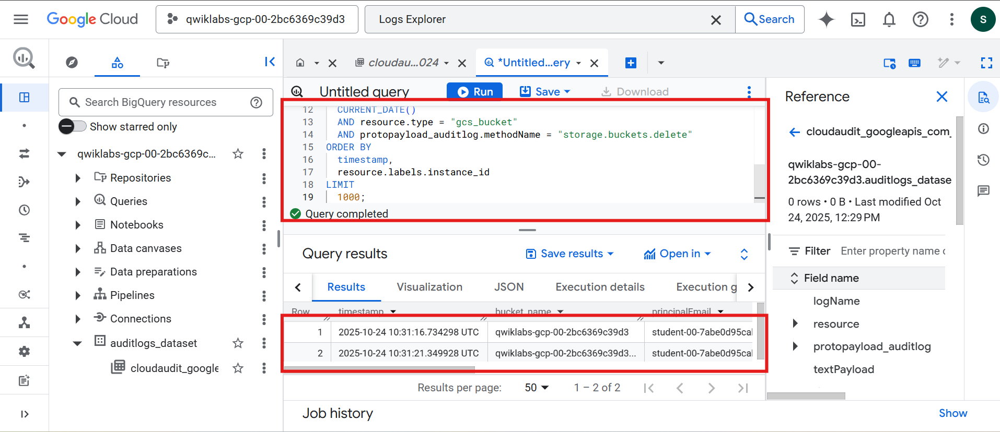
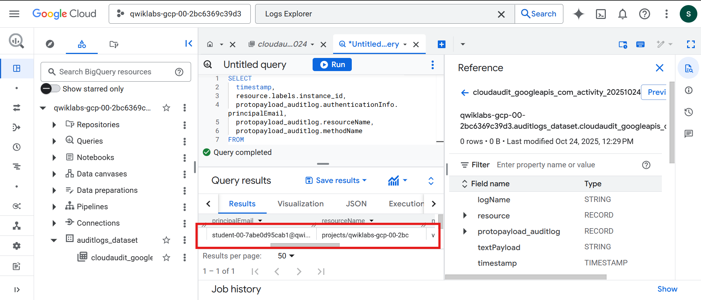

# 🧠 Lab 1 – Module 3: Analyze Audit Logs Using BigQuery  
**Course:** 1303 (Path 419 – Security in the Cloud)  
**Role:** Junior Cloud Security Analyst, Cymbal Bank  
**Duration:** ~1 h 30 min  

---

## 📘 Overview
In this lab, I acted as a cloud security analyst investigating suspicious activity within Google Cloud.  
Two users simulated an incident: **User 1** created and deleted resources, while **User 2** (the investigator) used Cloud Audit Logs and BigQuery to trace the malicious actions.  
The lab demonstrates how to identify, export, and analyze administrative events using Google Cloud’s native security and logging tools.

---

## 🎯 Objectives
- Generate audit-log activity by creating and deleting cloud resources.  
- Export Cloud Audit Logs to BigQuery through a logging sink.  
- Perform forensic analysis using Logs Explorer filters.  
- Query audit data in BigQuery with SQL to identify who deleted which resources.  

---

## 🧰 Tools & Services Used
- **Cloud Shell** – command-line execution and resource creation  
- **Cloud Logging / Logs Explorer** – real-time log inspection  
- **Log Router / Sink** – export pipeline to BigQuery  
- **BigQuery** – SQL-based audit-log analysis  
- **IAM & Audit Logs** – identity attribution (`principalEmail`)  
- **Compute Engine & Cloud Storage** – resources used for simulation  

---

## 🧩 Task Breakdown

### **Task 1 – Generate Account Activity**
Created a Cloud Storage bucket, uploaded a file, created a VPC network + VM, and deleted the bucket to generate Admin Activity logs.  
📸 **Evidence:**


---

### **Task 2 – Export Audit Logs to BigQuery**
Configured a log sink named `AuditLogsExport` to route new Cloud Audit Logs to a BigQuery dataset (`auditlogs_dataset`).  
📸 **Evidence:**


---

### **Task 3 – Generate More Activity**
Created two buckets and deleted a Compute Engine VM to ensure fresh logs were exported after sink creation.  
📸 **Evidence:**


---

### **Task 4 – Sign in as Investigator**
Switched to User 2 to preserve chain of custody and analyze logs as an independent account.  
📸 **Evidence:**


---

### **Task 5 – Analyze Admin Activity Logs**
Used Logs Explorer to filter `storage.googleapis.com` and `storage.buckets.delete` events, confirming that User 1 deleted the buckets.  
📸 **Evidence:**



---

### **Task 6 – Analyze Audit Logs in BigQuery**
Queried exported logs using SQL to identify VM and bucket deletions, displaying timestamps, resource names, and principal emails.  

**Sample Queries Used**
```sql
-- VM deletion
SELECT timestamp, resource.labels.instance_id,
       protopayload_auditlog.authenticationInfo.principalEmail,
       protopayload_auditlog.methodName
FROM `auditlogs_dataset.cloudaudit_googleapis_com_activity_*`
WHERE protopayload_auditlog.methodName = "v1.compute.instances.delete";

-- Bucket deletion
SELECT timestamp, resource.labels.bucket_name,
       protopayload_auditlog.authenticationInfo.principalEmail,
       protopayload_auditlog.methodName
FROM `auditlogs_dataset.cloudaudit_googleapis_com_activity_*`
WHERE protopayload_auditlog.methodName = "storage.buckets.delete";
```

📸 **Evidence:**  
  

---

## 🧾 Summary & Key Takeaways

**Audit Logs = Accountability:** Every administrative action is traceable to a principal email.  

**Log Sinks = Persistence:** Exporting to BigQuery ensures long-term retention and query power.  

**Forensics = Cross-validation:** Logs Explorer is for real-time inspection; BigQuery is for structured investigation.  

**Security Posture:** Cloud Audit Logs are critical for detecting resource tampering and confirming root cause of incidents.  

---

## 🧩 Conclusion

This lab demonstrated end-to-end incident analysis on Google Cloud.  
By generating activity, exporting logs, and performing SQL-based forensic queries, I validated the integrity of Cymbal Bank’s audit pipeline.  
These skills directly translate to real-world SOC operations — establishing visibility, detecting unauthorized actions, and enabling rapid incident response.  

---

## 🔗 References

- **Google Cloud Audit Logs Documentation**  
- **Guide to Log Queries, Exports, and Analysis (R-191)**  
- **BigQuery Query Syntax Reference**
