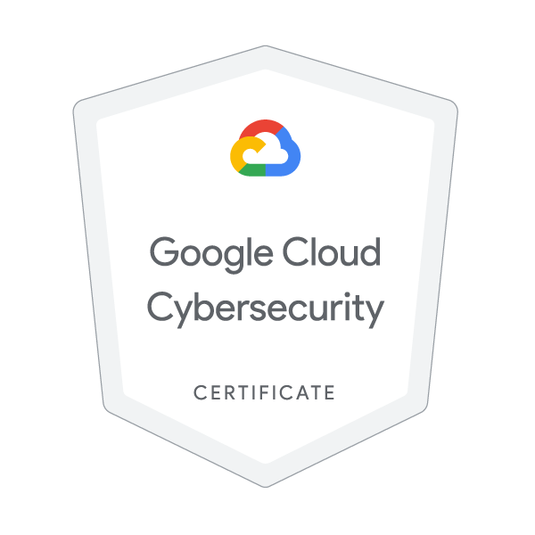

# ☁️ CloudSec Portfolio — Google Cloud Cybersecurity

Hands-on projects developed during the **Google Cloud Cybersecurity Certificate** program.  
This repository documents my practical experience in **cloud security architecture, vulnerability management, and incident response** using Google Cloud Platform (GCP).

Each lab and project follows the **NIST Cybersecurity Framework (CSF)** — *Identify, Protect, Detect, Respond, and Recover.*

---

## 🧩 Projects Overview

### 🔐 Identify & Protect — Course 1302

This section contains hands-on labs focused on **Identity & Access Management (IAM)**, **vulnerability assessment**, and **secure infrastructure deployment** using Google Cloud.

---

#### 🧩 Module 1 — IAM (Identity & Access Management)
Explored Google Cloud IAM roles, service accounts, and least-privilege principles.  
Key tasks:
- Created and managed **custom IAM roles** for fine-grained access control  
- Implemented **principle of least privilege** across resources  
- Tested permissions and verified **policy bindings** using the `gcloud` CLI  
- Captured audit logs for IAM activity verification  

📂 Folder: [`Labs/course-1302/Module-1-IAM`](./Labs/course-1302/Module-1-IAM)

---

#### 🧩 Module 2 — Vulnerability Management
Performed vulnerability identification and remediation on a cloud web application.  
Key tasks:
- Configured and executed scans using **Web Security Scanner**  
- Detected **Cross-Site Scripting (XSS)** and other injection vulnerabilities  
- Fixed public exposure and validated security with a re-scan  
- Linked findings to **Security Command Center (SCC)** for centralized visibility  

📂 Folder: [`Labs/course-1302/Module-2-Vulnerability`](./Labs/course-1302/Module-2-Vulnerability)

---

#### 🧩 Module 3 — Secure Infrastructure with Terraform
Applied **Infrastructure as Code (IaC)** principles using **Terraform** to enforce consistent and secure resource configurations.  
Key tasks:
- Built and deployed **VPC networks, subnets, and firewall rules** via Terraform  
- Applied security guardrails in configuration files (no public IPs, minimal open ports)  
- Validated compliance and reproducibility of infrastructure  
- Created a **Terraform Security Checklist** for future automation projects  

📂 Folder: [`Labs/course-1302/Module-3-Terraform`](./Labs/course-1302/Module-3-Terraform)


Each of these modules aligns with the **Protect** and **Identify** phases of the **NIST Cybersecurity Framework**, strengthening both access control and foundational cloud security posture.
---

### ⚙️ Detect & Respond — Course 1303

This course focuses on **threat detection**, **incident investigation**, **log analysis**, and **response actions** using Google Cloud tools such as **Chronicle**, **Security Command Center**, **BigQuery**, and **Google Backup & DR**.

---

#### 🧩 Module 1 — Threat Detection
Configured detection mechanisms and analyzed simulated security events in Google Cloud Security Command Center (SCC).  
Key tasks:
- Identified alerts generated by SCC and explored finding categories  
- Used **Chronicle SIEM** to investigate indicators of compromise (IOCs)  
- Mapped detection activity to **MITRE ATT&CK** tactics  
- Practiced interpreting real-time threat events and determining severity  

📂 Folder: [`Labs/course-1303/Module_1_threat_detection`](./Labs/course-1303/Module_1_threat_detection)

---

#### 🧩 Module 2 — Explore False Positives Through Incident Investigation
Investigated suspicious activity to separate true positives from false positives in Chronicle.  
Key tasks:
- Used **Chronicle Unified Data Model** to filter and classify events  
- Examined DNS and HTTP activity to confirm or dismiss alerts  
- Applied analytical queries to validate suspicious IPs and domains  
- Documented incident triage outcomes and escalation logic  

📂 Folder: [`Labs/course-1303/Module_2_Explore_false_positives_through_incident_investigation`](./Labs/course-1303/Module_2_Explore_false_positives_through_incident_investigation)

---

#### 🧩 Module 3 — Analyze Audit Logs Using BigQuery
Performed forensic log analysis on Google Cloud audit logs with **BigQuery** to uncover patterns of compromise.  
Key tasks:
- Queried **Cloud Audit Logs** for user activity and privilege escalation  
- Identified unauthorized API calls and potential insider threats  
- Built custom SQL queries for automated detection  
- Exported filtered results and visualized trends in query output  

📂 Folder: [`Labs/course-1303/Module_3_Analyze_audit_logs_using_BigQuery`](./Labs/course-1303/Module_3_Analyze_audit_logs_using_BigQuery)

---

#### 🧩 Module 4 — Recover VMs with Google Backup & DR
Executed post-incident recovery actions to restore compromised resources and verify system integrity.  
Key tasks:
- Used **Google Backup & DR** to snapshot and restore affected VMs  
- Validated that restored machines were malware-free before redeployment  
- Re-applied hardened firewall configurations  
- Verified compliance and updated Chronicle’s incident record for closure  

📂 Folder: [`Labs/course-1303/Module_4_Recover_VMs_with_Google_Backup&DR`](./Labs/course-1303/Module_4_Recover_VMs_with_Google_Backup&DR)

---

Each of these modules aligns with the **Detect**, **Respond**, and **Recover** phases of the **NIST Cybersecurity Framework**, demonstrating operational readiness and hands-on incident response in the Google Cloud environment.
---

### 🧱 Capstone Project — Respond & Recover
Simulated a real-world data breach at **Cymbal Bank**, then executed remediation actions to restore compliance and security posture.  
Steps performed:
1. Analyzed **Security Command Center (SCC)** findings  
2. Shut down the infected VM and restored from a secure snapshot  
3. Revoked **public bucket access** and enforced **uniform bucket-level control**  
4. Cleaned up **firewall rules** and enabled logging  
5. Verified remediation by running a **CIS 2.0 compliance report** with zero active findings  

📂 Folder: [`Capstone_Project/`](./Capstone_Project)

---

## 🧠 Skills & Tools

- **Google Cloud Security Command Center (SCC)**
- **Chronicle SIEM** (Google Security Operations)
- **IAM & Policy Troubleshooting**
- **Cloud Logging / Monitoring**
- **Web Security Scanner**
- **CIS Benchmark Auditing**
- **Incident Response & Playbooks**
- **Terraform (Secure Infrastructure as Code)**

---

## 📜 Repository Structure

```bash
📦 cloudsec-portfolio
 ┣ 📁 Capstone_Project           # Final breach remediation & compliance verification
 ┣ 📁 Labs                       # Course labs (Identify, Protect, Detect, Respond)
 ┣ 📁 docs                       # Diagrams, reports, and documentation
 ┣ 📁 evidence                   # Screenshots and proof of lab results
 ┣ 📁 logs                       # GCP command outputs and configurations
 ┗ 📁 scripts                    # Automation & cleanup scripts
```
## 🏅 Certification

**Google Cloud Cybersecurity Certificate**  
Credential earned via Google Cloud Skills Boost.  
This certification validates knowledge of **cloud threat mitigation**, **incident response**, and **security operations on GCP**.




---

## 🧭 Framework Alignment

All labs are mapped to the **NIST Cybersecurity Framework (CSF):**

| NIST Function | Example Implementation |
|----------------|------------------------|
| **Identify** | Asset inventory, IAM analysis |
| **Protect** | IAM least privilege, encryption, firewall hardening |
| **Detect** | Chronicle log correlation and anomaly detection |
| **Respond** | Incident response workflow & playbook |
| **Recover** | System restoration and compliance verification |

---

## 📫 Connect

👋 **Jeferson Madureira**  
🔗 [LinkedIn](https://www.linkedin.com/in/jeferson-madureira-4a526a109/)  
📧 madureira1985jeh@gmail.com  
💻 [GitHub](https://github.com/MadJeh)

---

## ✨ Summary

This repository serves as an **end-to-end showcase** of my technical capability in **Google Cloud Security** — from **policy design and detection engineering** to **incident remediation and recovery**.  
It reflects my **practical, evidence-driven approach** to building **secure cloud environments** and maintaining **continuous compliance**.

