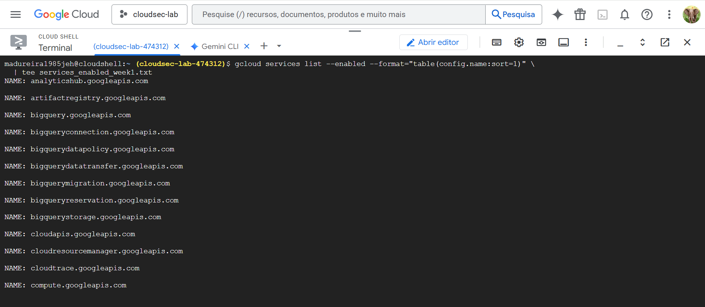

# Lab A — Cloud Shell + gcloud Basics

**Objective:** Set safe project context, enable core services, and capture evidence.  
**NIST CSF:** Identify (ID.AM-1), Protect (PR.AC-5)

---

## Steps Performed

```bash
gcloud config set project cloudsec-lab-474312
gcloud config set compute/region us-central1
gcloud config set compute/zone us-central1-a

gcloud services enable \
  compute.googleapis.com \
  iam.googleapis.com \
  logging.googleapis.com \
  monitoring.googleapis.com

gcloud services list --enabled --format="table(config.name:sort=1)" \
  | tee services_enabled_week1.txt
```
**Evidence & Screenshot**

- 📸 **Screenshot:** 
- 📄 **Enabled Services List:** [View services_enabled_week1.txt](../../logs/services_enabled_week1.txt)
