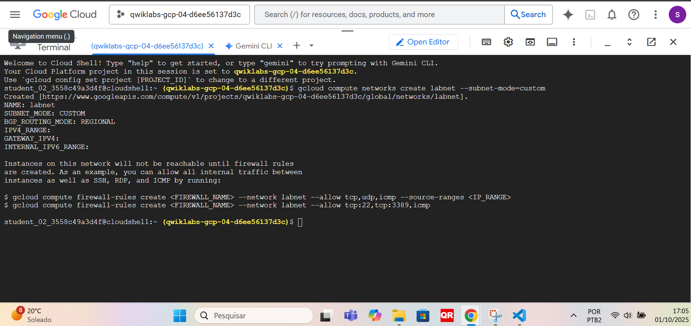
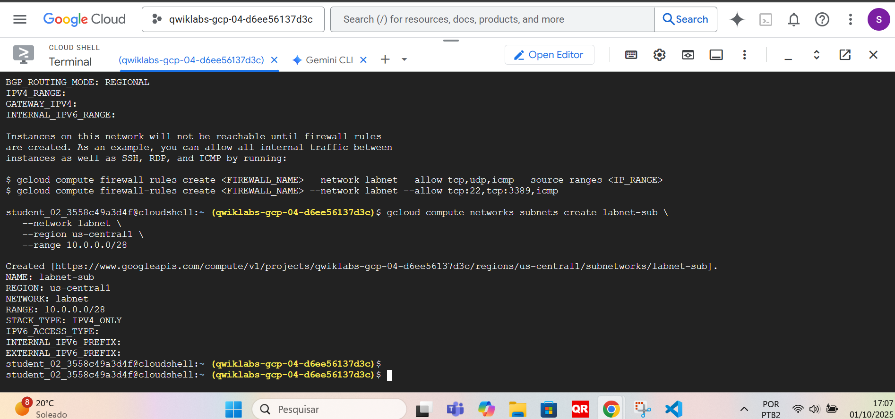
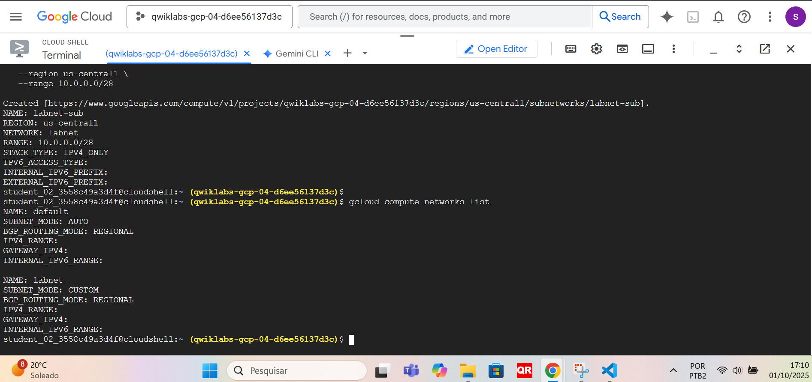
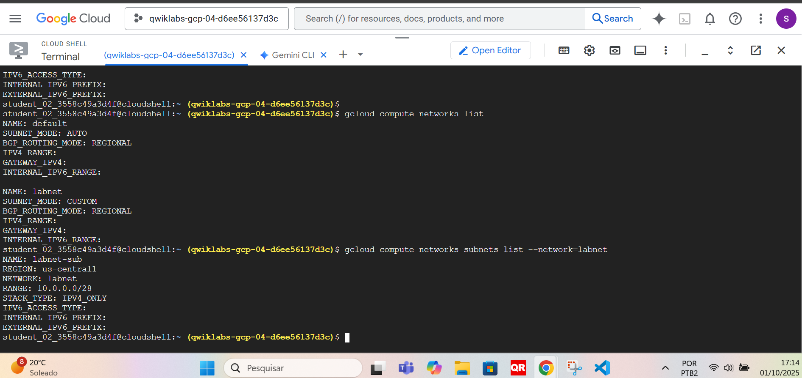

# Week 1 Lab — Create Custom VPC (Google Cloud Shell)

**Objective:** Practice creating a secure **custom VPC** and subnet using **Cloud Shell** to simulate Cymbal Bank’s hybrid-cloud migration.  
**Framework mapping:** NIST CSF → *Protect (PR.AC-5)*, *Detect (DE.CM-7)*

---

## Task 1 — Create Custom VPC

**Command**
```bash
gcloud compute networks create labnet --subnet-mode=custom
```
**Output**
```bash
NAME: labnet
SUBNET_MODE: CUSTOM
BGP_ROUTING_MODE: REGIONAL
```
**Screenshot**


## Task 2 — Create Subnet

**Command**
```bash
gcloud compute networks subnets create labnet-sub \
  --network labnet \
  --region us-central1 \
  --range 10.0.0.0/28
```
**Output**
```bash
NAME: labnet-sub
REGION: us-central1
NETWORK: labnet
RANGE: 10.0.0.0/28
STACK_TYPE: IPV4_ONLY
```
**Screenshot**


## Task 3 — View Networks

**Command**
```bash
gcloud compute networks list
```
**Output**
```bash
NAME: default
SUBNET_MODE: AUTO
...

NAME: labnet
SUBNET_MODE: CUSTOM
```
**Screenshot**


## Task 4 — List Subnets

**Command**
```bash
gcloud compute networks subnets list --network=labnet
```
**Output**
```bash
NAME: labnet-sub
REGION: us-central1
RANGE: 10.0.0.0/28
```
**Screenshot**


## Key Learnings
```bash
- Custom VPC (instead of Auto) = better control of IP ranges and segmentation, reducing attack surface.
- Subnet /28 limits the blast radius and organizes test environments.
- Network inventory (`gcloud compute networks list`, `gcloud compute networks subnets list`) is the foundation of governance and auditing.
```

## Cleanup (if using personal/Free Tier account)
```bash
gcloud compute networks subnets delete labnet-sub --region=us-central1 -q
gcloud compute networks delete labnet -q
```
